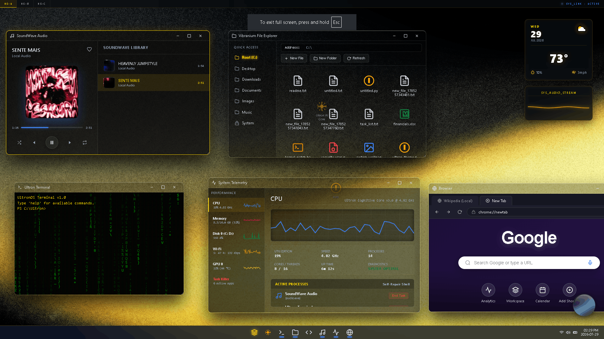

<div align="center">
  <h1>Arguably The Greatest OS Ever Built - UltronOS</h1>
  <p><i>Created for Standace challenge - WebOS 1</i></p>
</div>



##  Live Demo
[**Watch the demo video**](https://drive.google.com/file/d/14IgeUNn1ixcNtV0dWVF-dadHukLHW49Y/view)

[**Then try UltronOS**](https://hhhavvproject.vercel.app/)
-
##  Quick start

Clone the repository and deploy locally
```bash
git clone https://github.com/yourusername/UltronOS.git
cd UltronOS
npx http-server ./ -p 3000
```
Open `http://localhost:3000`

---

## System

Built without external UI frameworks (React, Vue, etc.)

* **DOM Window Manager**: A custom-engineered windowing. Has  main window focus, dragging and 3 distinct virtual workspaces.
* **Virtual File System** : Records file read/write operations and stores it to `localStorage`, allowing persistent file storage without a backend.
* **Async Component Mounting**: Uses a custom async engine to fetch and inject HTML components dynamically on-demand as the system is built to in parts.
* **Dynamic Theming**: Global CSS variable management that adapts when personalisation settings are changed.

---

## Applications and the ecosystem

* **Ultron AI Agent**: A text and voice-controlled assistant (Web Speech API). It is capable of executing OS-level operations (launching apps, writing files) using 15+ commands. Has 3d engineered animations depending on what it is doing  e.g talking, searching akin to Marvel's Ultron.
* **Vibranium File Explorer**: Graphical interface for the VFS. Has 5 root directories, file/folder creation, and icons for different file formats.
* **Ultron Terminal**: A fully functional CLI. Has 12+ working commands.
* **Code Studio**: Multi-format text editor, can edit almost all file types (.txt, md, .py)
* **System Telemetry**: A simulated task manager with simulated resource usage (ram, gpu, storage). Also has task-kill function that is functional.
* **SoundWave Player**: Audio client that supports 5 file fomats. Has basic player features -  start/pause, progress bar, thumbnail showing and so on.
* **Camera Environment**: Functional camera, uses browser's rights to use local camera. Has Canvas APIs for real-time shaders (B&W, blue tint), photo capture and media downloading.

---

## Plans for Web OS 2.0

- [ ] **Native TTS Engine**: Replace standard browser TTS with a custom, ultra-realistic local voice model trained on Marvel's Ultron videoclips.
- [ ] **CORS Proxy Integration**: Upgrade the internal browser to bypass header restrictions to allow unrestricted internet browsing.
- [ ] **Workflow Optimization**: Polish and complete every function/component to make a fully functional OS.

---

<details>
<summary><b> Appendix: Command Reference</b></summary>

### Ultron AI Commands
| Command | Action |
| :--- | :--- |
| `open / close <app_name>` | Launches or closes a system application |
| `close yourself` | Triggers a standby state and shuts down the AI core |
| `write file <name> <content>` | Creates a new file directly on the Virtual Desktop |
| `read / delete file <name>` | Reads or removes a file from the VFS |
| `system diagnosis` | Runs a simulated full-system diagnostic scan |
| `draw cat / house / smiley` | Generates custom ASCII art on the output canvas |
| `matrix / anger` | Triggers visual states and easter eggs |
| `weather / time / date` | Fetches current environmental telemetry |
| `clear` | Wipes the AI chat history |

###  Terminal Commands
* `help` - Show detailed manual.
* `sysinfo` - Display kernel diagnostics.
* `ultronfetch` - Visual system status dashboard.
* `clear` - Clear terminal screen.
* `matrix` - Toggle background matrix simulation.
* `theme` - Toggle interface color palette profiles.
* `open <app>` / `close <app>` - Manage GUI windows (terminal, explorer, code, chart).
* `speak <msg...>` - Broadcast statement from system voice core.
* `ls` - List files in virtual workspace.
* `cat <file>` - Print virtual file content.
* `write <file> <text...>` - Write or append text content to a file.
* `rm <file>` - Delete file from virtual workspace.

</details>
